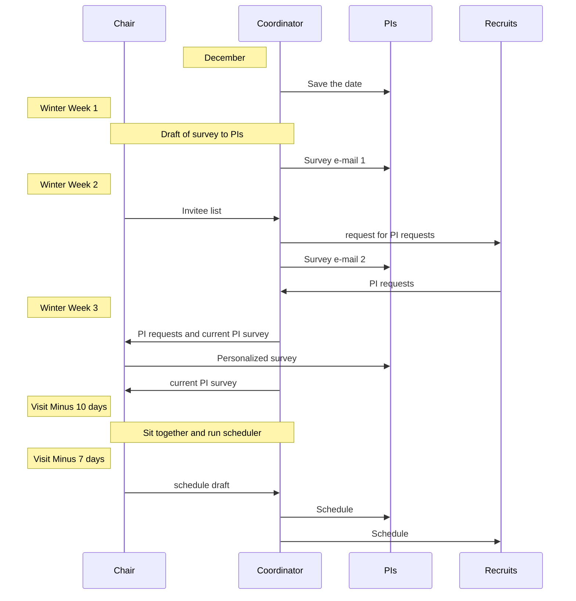

```mermaid
sequenceDiagram
    participant Chair
    participant Coordinator
    participant PIs
    participant Recruits

    Note left of Coordinator: December
    Coordinator->>PIs: Save the date

    Note left of Chair: Winter Week 1
    Note over Coordinator,Chair: Draft of survey to PIs
    Coordinator->>PIs: Survey e-mail 1

    Note left of Chair: Winter Week 2
    Chair->>Coordinator: Invitee list
    Coordinator->>Recruits: request for PI requests
    Coordinator->>PIs: Survey e-mail 2
    Recruits->>Coordinator: PI requests

    Note left of Chair: Winter Week 3
    Coordinator->>Chair: PI requests and current PI survey
    Chair->>PIs: Personalized survey
    Coordinator->>Chair: current PI survey

    Note left of Chair: Visit Minus 10 days
    Note over Coordinator,Chair: Sit together and run scheduler

    Note left of Chair: Visit Minus 7 days
    Chair->>Coordinator: schedule draft
    Coordinator->>PIs: Schedule
    Coordinator->>Recruits: Schedule

```
